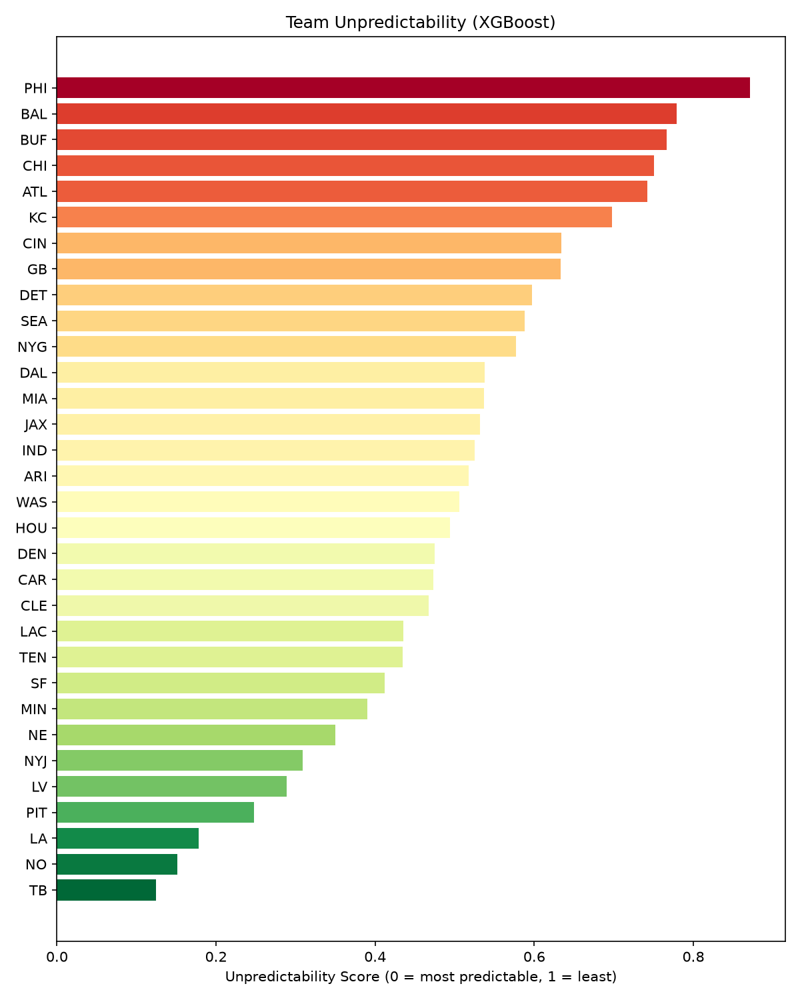

# NFL Play Predictor

Predicts whether an NFL offense will run or pass on a given play using
situational features (down, distance, score, time remaining, formation,
etc.), and uses the model's predicted probabilities to rank teams by how
"unpredictable" their play-calling is.

## Why this is interesting

Play-calling is driven by down, distance, score, and
time. A model trained on those situational variables should be able to
predict run/pass reasonably well. But some teams are closer to "textbook"
situational football than others. By looking at how confident (or wrong)
the model is on a per-team basis, we can quantify which offenses are the
hardest to predict from situation alone and which ones are the most
"by the book."

## Data

Play-by-play data comes from [nflverse](https://github.com/nflverse/nflverse-data)
via the `nfl_data_py` package, which pulls cleaned, pre-computed
situational columns for every play since 1999. No manual scraping or
CSV downloads required.

## Pipeline

```
data_loader.py      Downloads + locally caches play-by-play data (parquet)
features.py          Filters to run/pass plays, encodes categoricals,
                      splits by season (not randomly — avoids leakage
                      between plays in the same game), scales numerics
train.py              Trains a logistic regression baseline, evaluates it,
                      saves the model + test-set predictions
predictability.py     Uses saved predictions to rank teams by
                      unpredictability (entropy + log loss)
```

### Why split by season instead of randomly?

Plays within the same game aren't independent, score, weather, and game
script correlate across an entire drive or game. A random shuffle would
leak information between train and test. Instead, earlier seasons are
used for training and the most recent seasons are held out entirely,
which also mirrors the realistic use case: train on history, predict on
new games.

## Setup

Requires Python 3.11 (not 3.13+ — `nfl_data_py`'s pinned `pandas`/`numpy`
versions don't yet have prebuilt wheels for newer Python releases).

```bash
python -m venv venv
# Windows:
.\venv\Scripts\Activate.ps1
# macOS/Linux:
source venv/bin/activate

pip install -r requirements.txt
```

## Usage

Run in order — each step depends on files written by the previous one:

```bash
python train.py            # trains model, saves model.joblib + test_predictions.parquet
python predictability.py   # reads test_predictions.parquet, ranks teams
```

Outputs:
- `model.joblib` — trained model, scaler, and feature column list bundled together
- `test_predictions.parquet` — held-out test plays with predicted P(pass) attached
- `team_unpredictability.csv` — one row per team: entropy, log loss, accuracy, and a combined unpredictability score

## Methodology: measuring "unpredictability"

For each team, two complementary signals are computed over its test-set plays:

1. **Mean predictive entropy** — how close the model's predicted P(pass)
   sits to 0.5 on average. High entropy means the situational features
   don't give the model much to work with for that team — genuinely
   uncertain situations.
2. **Log loss** — how well the model's probabilities actually scored
   against that team's real play calls. A team can look "confident" to
   the model but still score a high log loss if the model is
   confidently *wrong* — meaning the team deviates from typical
   situational tendencies.

Both are min-max normalized and averaged into a single
`unpredictability_score`. Teams with fewer than 100 test-set plays are
excluded to avoid small-sample noise.

## Current model

Baseline: logistic regression on situational features (down, distance,
field position, score differential, time remaining, quarter, shotgun,
no-huddle, and one-hot encoded offense/defense team identity).

| Metric | Value |
|---|---|
| Accuracy | ~0.70 |
| Log loss | ~0.59 |

(Baseline for comparison: always guessing "pass" would get ~59% accuracy
given the class balance in this dataset — the model clears that, but
there's room to improve, particularly on run-play recall.)

## Known limitations

- **Coaching changes**: a team's play-calling identity can shift
  significantly with a new OC/HC mid-dataset. The model doesn't account
  for this, so a team that changed systems may look artificially
  "unpredictable" simply because recent play-calling doesn't match older
  training data.
- **Garbage time**: teams trailing heavily late in games pass far more
  regardless of underlying tendency, which can skew per-team metrics if
  not filtered or controlled for.
- **Sample size**: some team/situation combinations are rare (e.g. 3rd
  and long, trailing, 4th quarter), so metrics for low-volume teams
  should be read with caution — see `n_plays` in the output.

## Results

Logistic regression and XGBoost were trained independently and largely
agree on which teams are hardest to predict from situation alone.
Baltimore, Philadelphia, Buffalo, Chicago, and Atlanta rank as the most
unpredictable offenses in both models, consistent with the heavy
read-option / RPO usage in several of these offenses, where the run-pass
decision is made post-snap and isn't fully captured by pre-snap
situational features. Tampa Bay, New Orleans, the Rams, Jets, and
Steelers rank as the most predictable in both.



See [RESULTS.md](RESULTS.md) for the full write-up, model comparison
table, and limitations.

## Planned improvements

- Replace logistic regression with XGBoost for better handling of
      feature interactions and class imbalance
- Visualize per-team unpredictability (bar chart / scatter of
      entropy vs. log loss)
- Control for garbage-time situations in the predictability analysis
- Extend beyond run/pass to pass direction / run gap prediction
