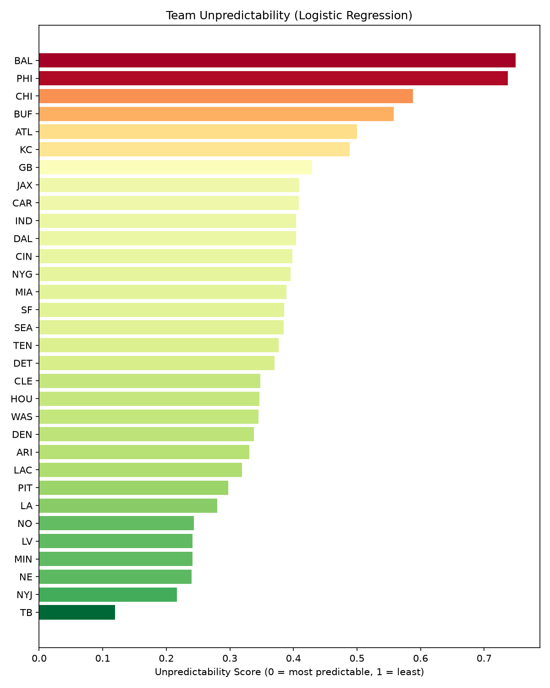
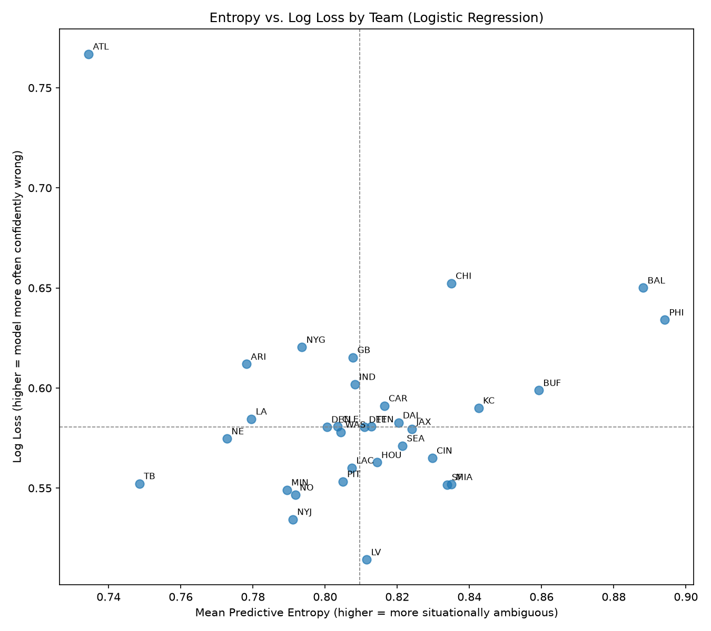
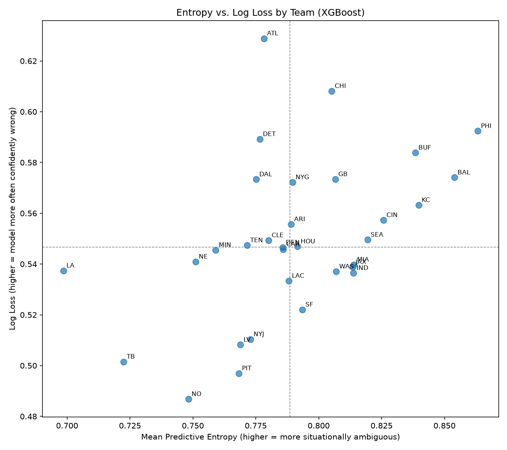

# Results

## Model comparison

| Metric | Logistic Regression | XGBoost |
|---|---|---|
| Accuracy | ~0.70 | ~0.71 |
| Log Loss | ~0.59 | ~0.55 |

XGBoost improved on the logistic regression baseline on both accuracy and
log loss, consistent with what you'd expect: run/pass decisions depend on
interactions between situational variables (e.g. "down AND distance AND
score together," not each independently), which a linear model can only
approximate and a tree-based model captures directly. XGBoost's
`scale_pos_weight` also corrected the run-play recall weakness the
baseline showed — the logistic regression correctly identified actual
run plays only 50% of the time, missing half of them in favor of
over-predicting pass.

## Which teams are most unpredictable?

Both models were used to independently rank all 32 teams by
unpredictability (a blend of predictive entropy and log loss on each
team's held-out 2022–2023 plays). The two models — one linear, one
tree-based — largely agree:

**Most unpredictable (both models):** Baltimore, Philadelphia, Buffalo,
Chicago, Atlanta

**Most predictable (both models):** Tampa Bay, New Orleans, LA Rams,
NY Jets, Pittsburgh

This cross-model agreement is the most important result here. The two
models make different assumptions about how features interact, so
agreement between them suggests the unpredictability signal reflects
something real about these teams' play-calling, rather than an artifact
of either model's particular biases.

| Logistic Regression | XGBoost |
|---|---|
|  |  |

| Logistic Regression | XGBoost |
|---|---|
|  |  |

### A likely explanation: dual-threat quarterbacks and RPOs

Four of the five most unpredictable teams: Baltimore (Lamar Jackson),
Philadelphia (Jalen Hurts), Buffalo (Josh Allen), and to a lesser extent
Chicago which are run offenses built heavily around read-option and run-pass
option (RPO) concepts, where the quarterback decides whether to hand off,
keep, or throw *after* the snap, based on a post-snap defensive read.
This matters for the model specifically: all of the model's features
(down, distance, score, formation, etc.) are pre-snap information. If the
actual run/pass decision is frequently made after the snap based on
defensive alignment, no amount of pre-snap situational data can fully
predict it because the team is unpredictable not by coincidence, but
structurally, by design.

Atlanta is a partial exception to this pattern, its offense in this
window wasn't RPO-centric in the same way, suggesting there may be a
second factor at play beyond quarterback mobility, such as a more
balanced or situationally non-standard play-calling tendency. Kansas
City also ranks as moderately unpredictable in both models despite
Patrick Mahomes operating a more traditional pocket-passing offense,
which is a useful counter-example: it shows the pattern found here is a
strong trend, not a universal rule, and that other factors (offensive
coordinator tendencies, year-to-year scheme changes) likely contribute
too.

### Predictable teams

The most predictable teams: Tampa Bay, New Orleans, the Rams, Jets, and
Steelers were largely stable systems with primarily pocket-passing or
traditionally scripted run offenses without heavy RPO usage over this
period, consistent with the proposed explanation above.

## Limitations

- **Test window is narrow (2022–2023 only).** This measures predictability
  in a specific two-season snapshot. A coaching change or scheme shift
  mid-window could shift a team's measured predictability independent of
  any real change in its offensive identity.
- **No play-caller attribution.** Results are attributed to teams, not
  offensive coordinators. A team with a coaching change during the
  training period (2015–2021) but a stable staff during the test period
  (or vice versa) could show inflated or deflated unpredictability simply
  due to this mismatch, not a genuine shift in tendencies.
- **Garbage time is not separately controlled for.** Blowout-driven
  pass-heavy or run-heavy stretches late in games are included in the
  overall numbers and could be inflating or dampening entropy for teams
  that were frequently in one-sided games during the test window.
- **Correlation, not proof, on the RPO explanation.** The dual-threat QB /
  RPO explanation is a plausible, literature-consistent interpretation of
  the pattern observed, not something directly tested here. A follow-up
  analysis adding a quarterback mobility metric (e.g. rush attempts per
  game, or a scheme-tag feature) as an input feature would let this be
  tested more rigorously.

## Possible follow-ups

- Add a quarterback mobility / rushing-attempts feature to test the RPO
  hypothesis directly rather than inferring it after the fact
- Control for garbage time (e.g. exclude plays where win probability is
  above/below a threshold) and re-run the predictability ranking
- Extend the test window across more seasons to check whether team
  rankings are stable year-over-year or fluctuate with coaching changes
- Break predictability down by situation (e.g. is a team unpredictable
  everywhere, or only in specific down/distance buckets like short
  yardage?)
